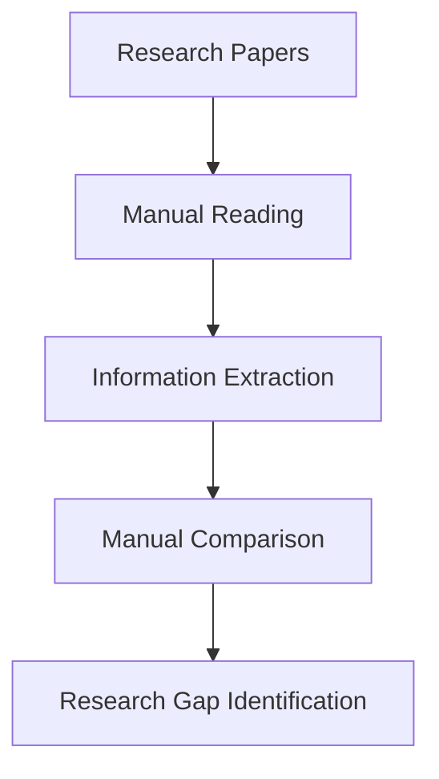
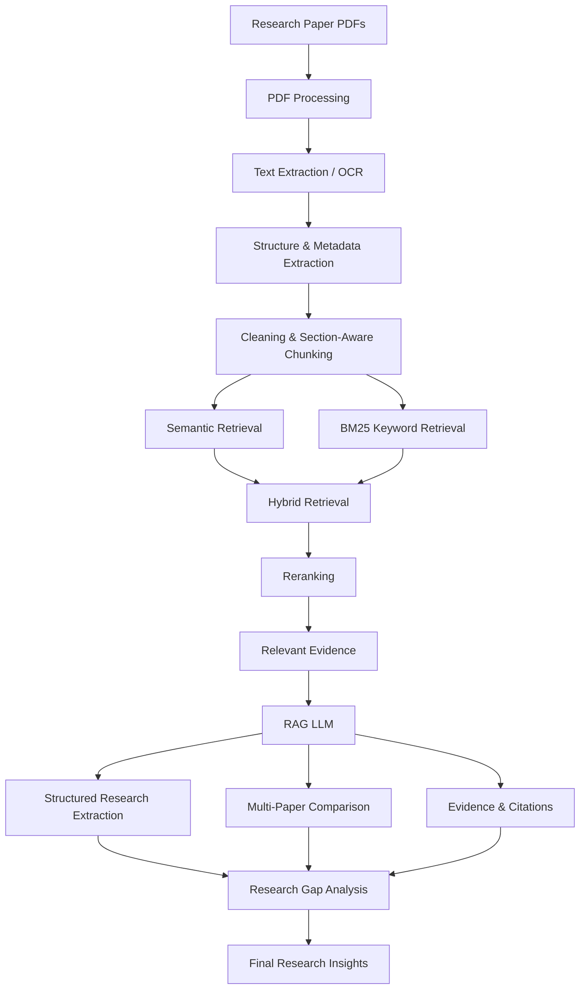
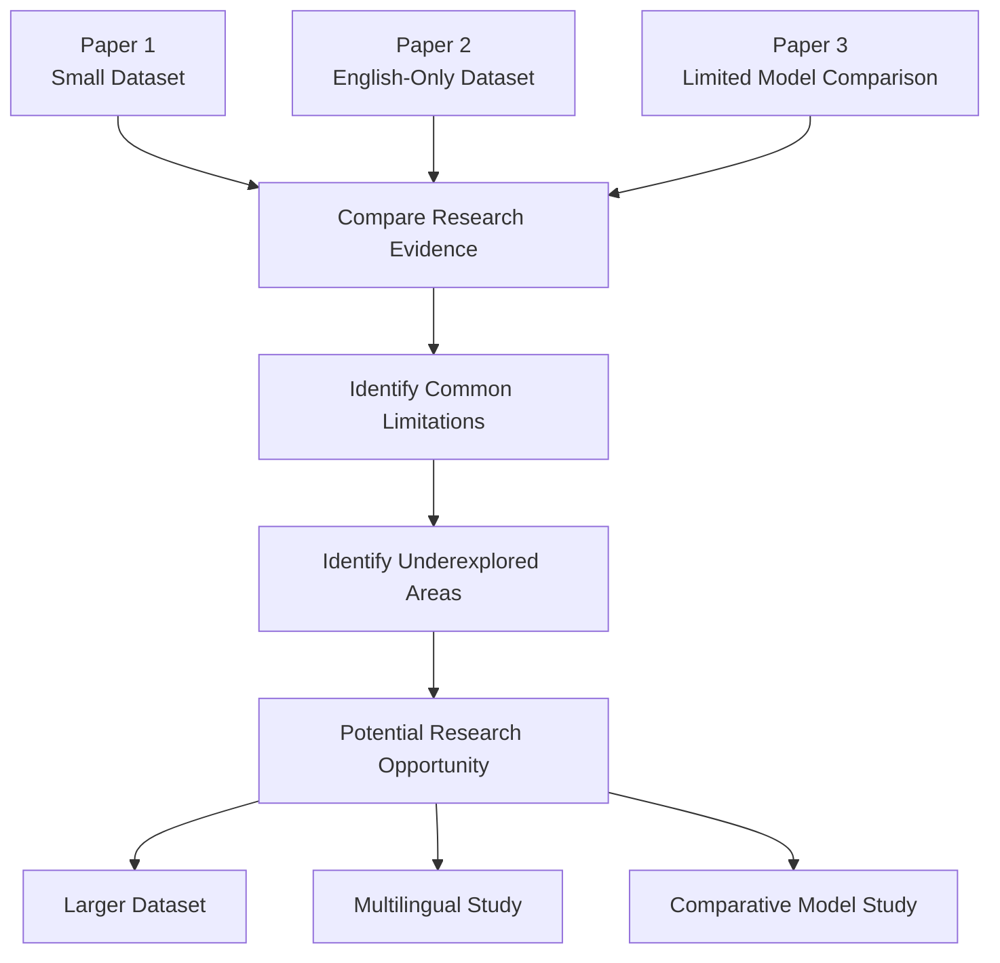
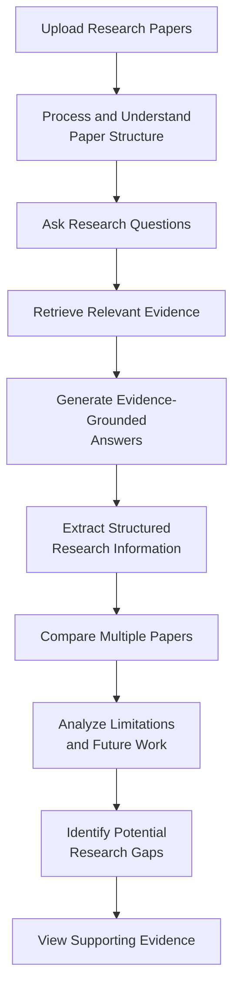

# AI-Based Research Paper Intelligence System Using RAG

### Structured Knowledge Extraction, Multi-Paper Analysis and Evidence-Grounded Research Gap Identification

---

## 1. Project Overview

Research papers contain valuable information, but extracting and comparing that information manually is time-consuming.

This project develops an **AI-Based Research Paper Intelligence System using Retrieval-Augmented Generation (RAG)** to automatically extract structured information from research papers, retrieve relevant evidence, compare multiple papers, and identify potential research gaps.

### Main Objectives

- Extract structured information from research papers
- Answer questions using evidence from the papers
- Compare multiple research papers
- Identify limitations and future research directions
- Support evidence-grounded research gap analysis
- Provide page/section-level references for generated information

---

## 2. Problem Statement

Researchers and students often need to read and analyze a large number of research papers during literature review.

Traditional literature review requires:

- Manually reading papers
- Finding important information
- Comparing different methodologies
- Understanding datasets and results
- Identifying limitations
- Finding possible research gaps

This process is:

- Time-consuming
- Difficult to scale
- Difficult to compare across many papers
- Prone to missing important information
- Difficult for identifying research gaps systematically

Therefore, an intelligent system is required to assist users in understanding and analyzing research papers efficiently.

---

## 3. Existing Methods

### 3.1 Manual Literature Review

### Limitations
- Time-consuming
- Difficult to analyze a large number of papers
- Important information may be missed
- Difficult to compare different studies
- Research gaps are difficult to identify systematically.
---
### 3.2 Basic PDF Chatbot / RAG

A typical PDF-based RAG system follows:

**PDF → Text Extraction → Chunking → Embeddings → Vector Database → Similarity Search → LLM → Answer**

### Limitations

- Mainly focused on question answering
- Limited structured research information extraction
- Limited multi-paper comparison
- Limited research-gap analysis
- Source attribution may be limited
- Retrieval and answer quality may not be systematically evaluated

---

## 4. Base Paper

### FutureGen: A RAG-based Approach to Generate the Future Work of Scientific Article

**Conference:** IEEE eScience 2025  
**DOI:** 10.1109/eScience65000.2025.00087

### Why This Paper Is Relevant

FutureGen applies Retrieval-Augmented Generation to scientific articles to generate potential future research directions.

The paper is relevant to our project because it addresses:

- Scientific research articles
- Retrieval-Augmented Generation
- Related research information
- Future research directions
- Hallucination
- Evaluation

### Relationship to Our Project

FutureGen primarily focuses on generating future work and research directions from scientific articles.

Our project extends the research-paper analysis workflow by incorporating:

- Structure-aware research-paper processing
- Hybrid semantic and keyword retrieval
- Reranking
- Structured research information extraction
- Multi-paper comparison
- Evidence and source attribution
- Evidence-based research-gap analysis

Therefore, FutureGen serves as an important research foundation and inspiration for our proposed system rather than being reproduced directly.

---

## 5. Proposed System

The proposed system provides an end-to-end workflow for research-paper intelligence.

### Main Capabilities

1. Research paper ingestion and processing
2. Research-paper structure and metadata extraction
3. Section-aware text chunking
4. Semantic and keyword-based retrieval
5. Hybrid retrieval
6. Reranking of retrieved evidence
7. RAG-based question answering
8. Structured research information extraction
9. Multi-paper comparison
10. Evidence and page/section attribution
11. Potential research-gap identification
12. Retrieval and answer evaluation

---

## 6. System Architecture

### Overall Architecture

### Architecture Flow

---

## 7. Key Difference from FutureGen

| FutureGen | Proposed System |
|---|---|
| Scientific articles | Multiple research papers |
| Uses RAG | Uses RAG |
| Focuses on future-work generation | Provides broader research-paper intelligence |
| Generates future research directions | Extracts structured research information |
| Uses related research context | Uses hybrid retrieval and reranking |
| Evaluates generated research directions | Evaluates retrieval, extraction and generated answers |
| Mainly focused on future work | Supports comparison, evidence attribution and research-gap analysis |

### Core Extension

FutureGen focuses primarily on generating future research directions, while our proposed system aims to provide a broader research-paper intelligence workflow for extracting, retrieving, comparing, and analyzing scientific literature.

---

## 8. Research Information Extracted

For each research paper, the system aims to extract:

| Information | Description |
|---|---|
| Title | Research paper title |
| Authors | Paper authors |
| Research Problem | Problem addressed |
| Objective | Main research objective |
| Dataset | Dataset used |
| Methodology | Proposed methodology |
| Algorithms | Algorithms/models used |
| Evaluation Metrics | Metrics used |
| Results | Experimental results |
| Limitations | Reported limitations |
| Future Work | Suggested future research |

---

## 9. Research Gap Analysis

The system does not claim to automatically discover completely new scientific knowledge.

Instead, it identifies potential research opportunities from evidence available in the analyzed papers.

The identified observations should be linked to the supporting research papers and evidence.

---
## 10. Target Users
Students
- Literature review
- Understanding research papers
- Project topic analysis
- Comparing existing approaches
- Identifying potential research directions
Researchers
- Literature analysis
- Multi-paper comparison
- Methodology comparison
- Dataset and model analysis
- Research-gap identification
Faculty / Project Guides
- Reviewing research literature
- Supporting project topic selection
- Understanding existing approaches
- Identifying research opportunities
---
## 11. Technology Stack
Component	Proposed Technology
Programming Language	Python
PDF Processing	PyMuPDF
OCR	Tesseract / Suitable OCR
Embeddings	Sentence Transformers
Vector Search	FAISS / Chroma
Keyword Retrieval	BM25
Reranking	Cross-Encoder
Generation	Large Language Model
Interface	Streamlit
Version Control	Git & GitHub

---

## 12. Evaluation
The project will be evaluated through measurable experiments maintained in the GitHub repository.
Retrieval Evaluation
- Precision@K
- Recall@K
- Mean Reciprocal Rank (MRR)
Information Extraction Evaluation
- Dataset extraction accuracy
- Model/algorithm extraction accuracy
- Metric/result extraction accuracy
- Limitation/future-work extraction accuracy
RAG Answer Evaluation
- Answer relevance
- Faithfulness
- Groundedness
System Evaluation
- Retrieval latency
- Response time
- Error analysis
---
## 13. Expected Outcome

The final system should allow a user to:

---
## 14. References
1. FutureGen: A RAG-based Approach to Generate the Future Work of Scientific Article, IEEE eScience 2025.
   DOI: 10.1109/eScience65000.2025.00087
2. A Survey of Retrieval-Augmented Generation (RAG) for Large Language Models, IEEE, 2025.
   DOI: 10.1109/ICTBAI68361.2025.00008
3. Integrating External Knowledge with LLMs: A Systematic Review of RAG Approaches, IEEE MIPRO 2025.
